# 在线考试系统 · 测试报告

> 交付日期：2026-09-09 ｜ 测试人：邓钰浩（前端页面板块 + 软件测试）
> 被测系统：`D:\学校管理系统_完善版\`（缺陷修复后版本，v3）
> 配套文档：《在线考试系统_手工测试手册.md》（执行依据）、《学校管理系统_缺陷修复说明_v3.md》（修复依据）
> 测试类型：手工功能测试（回归验收，覆盖 7 项缺陷修复）

---

## 一、测试概述

### 1.1 测试目标

对 v2 修复版已修复的 7 项缺陷做回归验收，验证：
1. 交卷成绩真实落库、防重复交卷（缺陷 #1）
2. 判分只按本卷题目（缺陷 #2）
3. 简答题答案落库、人工阅卷闭环（缺陷 #3）
4. 登录态持久、刷新不掉线（缺陷 #4）
5. 交卷成绩归属考生本人（缺陷 #5）
6. 学生/管理端成绩页均为真数据（缺陷 #6）
7. 管理端组卷可真实关联题目（缺陷 #7）

### 1.2 测试环境

| 项 | 值 |
|---|---|
| 系统启动 | `启动系统.bat`（MySQL 3307 + Redis 6379 + 后端 8080 + 前端 5173） |
| 前端地址 | http://localhost:5173 |
| 后端地址 | http://localhost:8080/api |
| 管理员账号 | admin / 123456（系统管理员） |
| 考生账号 | student / 123456（测试考生，计算机学院） |
| 测试用卷 | 2026年企业级Java高级开发工程师认证考试（试卷 1：客观 4 题×20 分 + 简答 1 题×20 分 = 100 分） |
| 数据库 | MySQL（exam_system，交付库初始成绩表 0 行） |

### 1.3 测试数据路径

按手册标准路径执行：**客观题全对交卷 → 80 分待阅卷 → 教师人工阅卷给简答 15 分 → 总分 95 已阅卷**，全程真实操作、真实落库，无假数据。

---

## 二、测试结果汇总

| 缺陷 | 对应用例 | 预期结果 | 实测结果 | 结论 |
|---|---|---|---|---|
| #1 交卷成绩不落库 | TC-03 / TC-04 | 80 分落库 1 行，重复交卷被拒 | exam_score 写入 80.0/status=1；重复进入被拦截提示 | ✅ 通过 |
| #2 判分遍历全题库 | TC-03 | 只按本卷 5 题判分（非题库全部） | exam_answer 明细 5 行（question_id 1,2,3,4,6），4 客观题各 20 分 | ✅ 通过 |
| #3 主观题答案丢弃 | TC-03 / TC-06 | 简答落库可阅，给 15 分后总分 95 | 简答作答与参考答案可见；给 15 分后总分 95.0/status=2 | ✅ 通过 |
| #4 登录态不持久 | TC-01 | 刷新不掉线，退出生效 | F5 刷新后仍在登录态，考生姓名"测试考生" | ✅ 通过 |
| #5 交卷不带身份 | TC-03 | 成绩归属 student（user_id=2） | 成绩行 user_id=2（测试考生本人） | ✅ 通过 |
| #6 成绩页假数据 | TC-05 / TC-07 | 学生/管理端成绩页均为真数据 | 学生端 80 分待阅卷→95 分已阅卷；管理端 95 分已阅卷（真实联查） | ✅ 通过 |
| #7 组卷无题目关联 | TC-08 | 弹窗勾选真实保存到关联表 | exam_paper_question 5 行（question_id 1,2,3,4,6），弹窗回显勾选 | ✅ 通过 |

**结论：7 项缺陷修复全部验收通过，无遗留问题。**

---

## 三、用例执行记录（含截图证据）

### TC-01 登录态持久化（缺陷 #4 验收）

**步骤**：student/123456 登录 → 提示"登录成功"进入考生首页 → **F5 刷新** → 仍处于登录状态（修复前刷新即回登录页）。

**实测**：✅ 与预期一致。刷新后仍显示考生姓名"测试考生"。

**截图证据**：

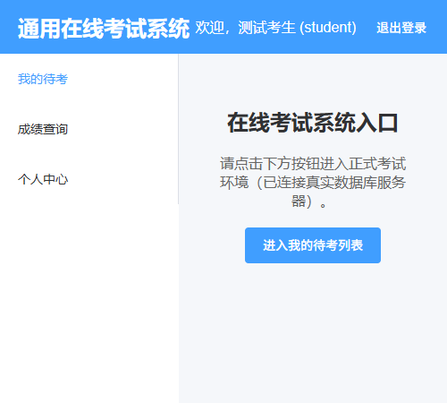

*图 1：student 登录成功，刷新页面后仍保持登录态（缺陷 #4 修复验证）*

---

### TC-02 考生查看考试并进入考场（缺陷 #5 #2 验收）

**步骤**：考生首页显示考试"2026年企业级Java高级开发工程师认证考试"（来自后端非写死）→ 点击进入答题页 → 顶部显示真实姓名"测试考生" → 页面共 4 道客观题（80 分）+ 1 道简答题（20 分）= 100 分。

**实测**：✅ 与预期一致。考试房间顶部显示真实姓名"测试考生"（修复前为占位"考生"），题目分布 4 客观 + 1 简答共 100 分。

**截图证据**：

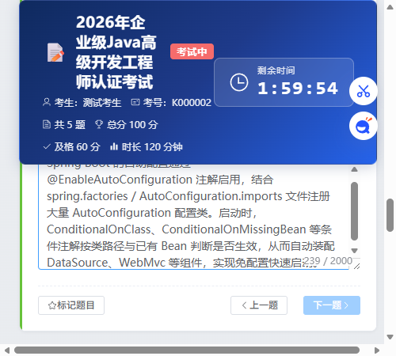

*图 2：考试房间页——顶部真实姓名"测试考生"，5 题 100 分布局（缺陷 #5 #2 修复验证）*

---

### TC-03 答题与交卷落库（缺陷 #1 #2 #3 验收）

**步骤**：客观题全对作答（答案见手册附录 A）、简答输入任意文字 → 交卷 → 确认弹窗 → 提示交卷成功 → 后端查库验证。

**实测**：✅ 与预期一致。

**① 交卷成功提示：**

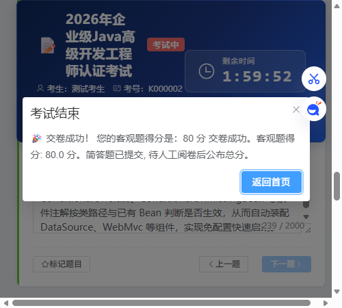

*图 3：交卷成功提示弹窗（缺陷 #1 修复验证）*

**② 后端查库（成绩真实落库的铁证）：**

```sql
SELECT total_score, status FROM exam_score WHERE user_id=2 AND batch_id=1;
-- 实测 → 80.0 | 1（1=待阅卷）

SELECT question_id, correct_flag, got_score FROM exam_answer WHERE user_id=2 AND batch_id=1;
-- 实测 → 5 行：1,2,3,4（correct_flag=1，各 20 分）+ 6（correct_flag=0，0 分待人工阅卷）
```

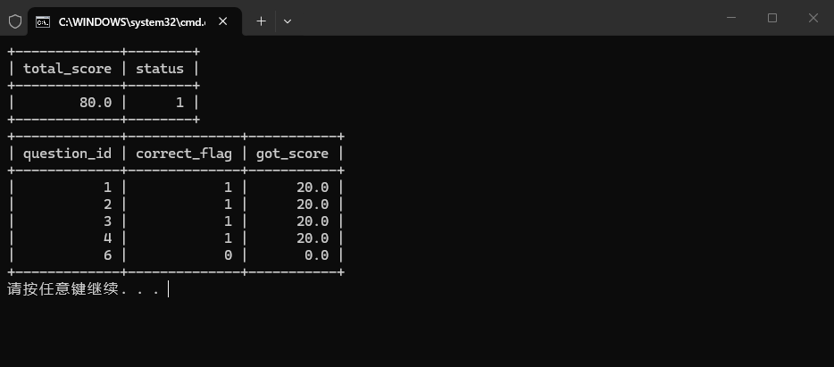

*图 4：成绩落库铁证——exam_score 一行 80.0/status=1，exam_answer 明细 5 行（客观 4 题全对各 20 分，简答 q6 待阅）（缺陷 #1 #2 #3 修复验证）*

---

### TC-04 防重复交卷（缺陷 #1 附加验收 + v3 回归）

**步骤**：交卷后再次点击进入该考试 → 系统在进入时拦截。

**实测**：✅ 与预期一致。弹窗提示"您已提交过本场考试的答卷，不能重复进入考试"并返回考试列表；后端兜底拒绝重复交卷，成绩不被覆盖（exam_score 仍为 1 行）。

**截图证据**：

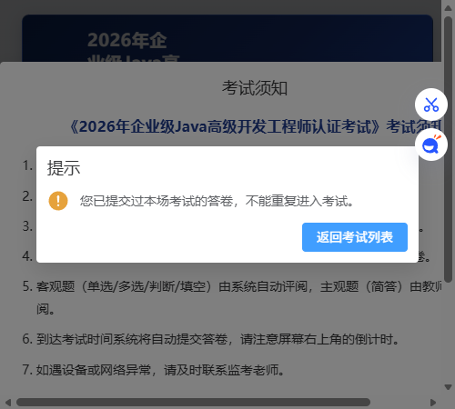

*图 5：重复进入考试被系统拦截提示（缺陷 #1 + v3 修复①入口拦截验证）*

---

### TC-05 考生查成绩（缺陷 #6 验收：MyScore 真数据）

**步骤**：考生端进入"我的成绩"页 → 应显示考试名、80 分、状态"待阅卷"、及格线 60 → 点查看明细可见每题作答与得分。

**实测**：✅ 与预期一致。成绩页显示 **80 / 100 待人工阅卷**（修复前为模板假数据 95/通过）；明细页客观题 4×20=80 分、简答显示待人工评阅。

**① 成绩列表页：**

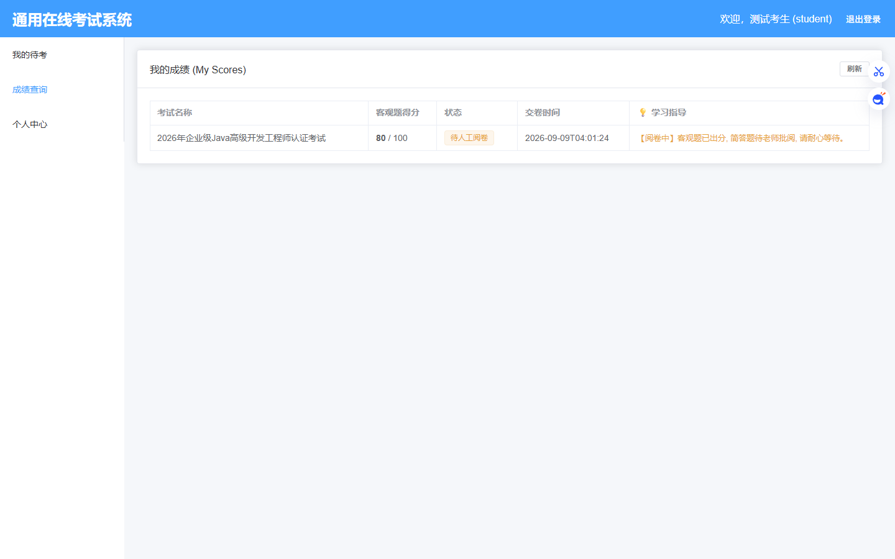

*图 6：考生成绩页——真实分数 80/100、状态"待人工阅卷"（缺陷 #6 修复验证）*

**② 成绩明细页：**

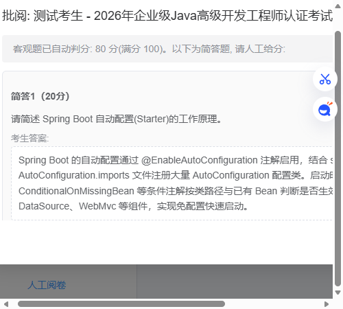

*图 7：成绩明细——客观题 4×20=80 分得分入列、简答题待人工评阅（缺陷 #3 #6 修复验证）*

---

### TC-06 教师/管理员人工阅卷（缺陷 #3 #7 验收）

**步骤**：admin 登录 → 阅卷评分 → 人工阅卷 → 待阅列表应出现测试考生 1 条 → 点"批阅简答题"查看作答与参考答案 → 输入分数 **15** → 提交 → 后端查库验证总分。

**实测**：✅ 与预期一致。

**① 待阅列表：**

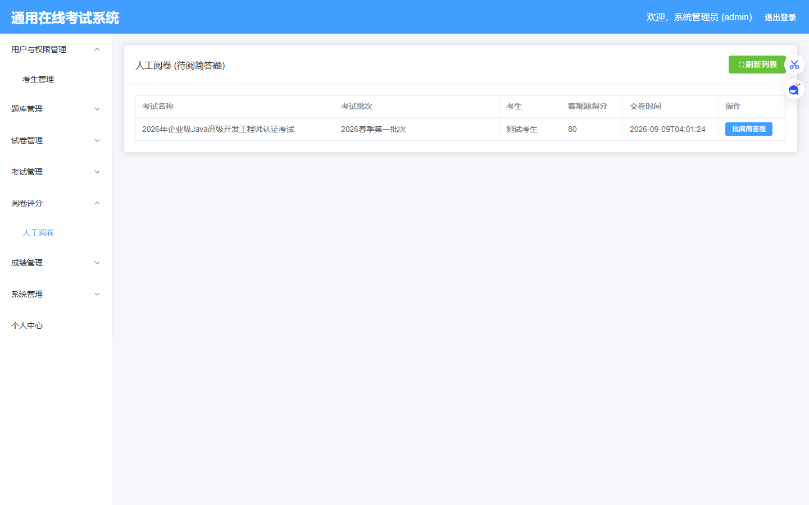

*图 8：待阅列表——测试考生 80 分 1 条记录（缺陷 #3 修复验证）*

**② 给分操作页（考生作答 + 参考答案 + 得分输入）：**

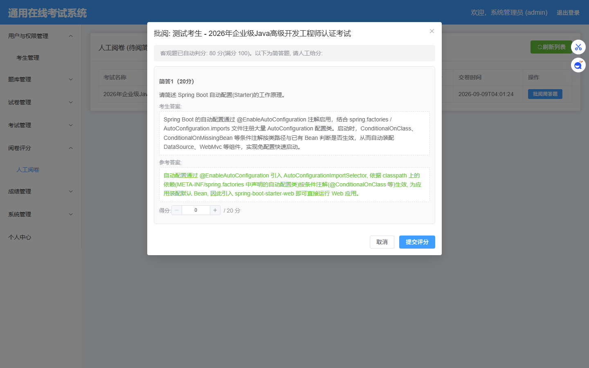

*图 9：批阅页——考生简答作答、参考答案、得分框（缺陷 #3 修复验证）*

**③ 提交后查库（人工阅卷闭环打通铁证）：**

```sql
SELECT total_score, status FROM exam_score WHERE user_id=2 AND batch_id=1;
-- 实测 → 95.0 | 2（2=已阅卷） 即 80 客观 + 15 简答 = 95
```

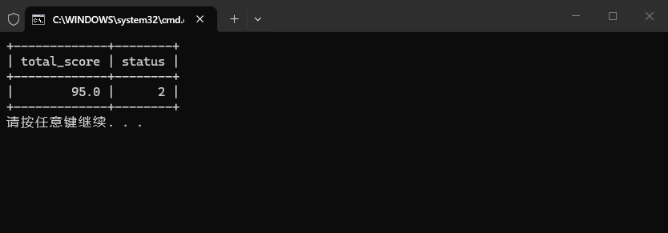

*图 10：人工阅卷闭环铁证——给 15 分后 total_score=95.0、status=2 已阅卷（缺陷 #3 修复验证）*

---

### TC-07 管理端成绩查询（缺陷 #6 验收：ScoreList 真数据）

**步骤**：admin 登录 → 成绩管理 → 成绩查询与审核 → 应显示测试考生成绩 95 分、已阅卷（真实联查）。

**实测**：✅ 与预期一致。列表显示 **95 / 100 通过**。

**截图证据**：

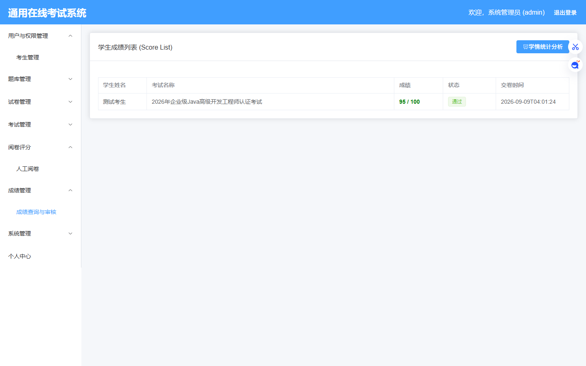

*图 11：管理端成绩查询——测试考生 95/100 通过（真实联查数据，缺陷 #6 修复验证）*

---

### TC-08 管理端组卷（缺陷 #7 验收：配置题目）

**步骤**：admin → 试卷管理 → 试卷列表 → 找到考试卷 → 点"配置题目" → 弹窗内应已勾选 5 道题（1,2,3,4,6）→ 取消第 6 题再勾回 → 保存成功 → 后端查关联表。

**实测**：✅ 与预期一致。弹窗回显已绑 5 题、总分恰好 100，保存成功；exam_paper_question 表 5 行关联。

**① 组卷弹窗（题目勾选回显）：**

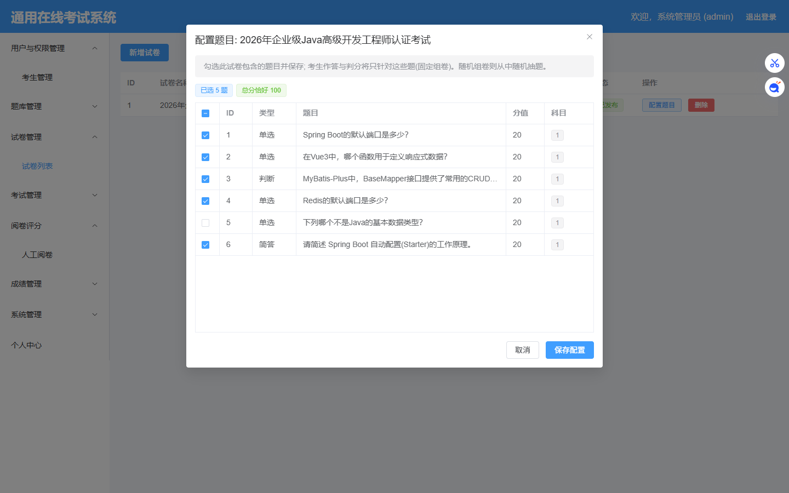

*图 12：组卷弹窗——已绑题目回显勾选、总分恰好 100（缺陷 #7 修复验证）*

**② 后端查库：**

```sql
SELECT question_id FROM exam_paper_question WHERE paper_id=1;
-- 实测 → 5 行：1, 2, 3, 4, 6
```

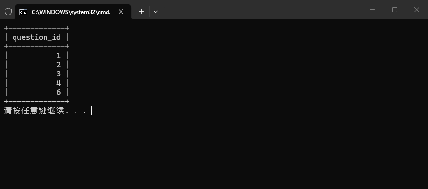

*图 13：组卷关联铁证——exam_paper_question 中试卷 1 关联题目 1,2,3,4,6 共 5 行（缺陷 #7 修复验证）*

---

## 四、缺陷发现与修复过程说明

本次为**修复后回归验收**，未再发现新缺陷。修复前缺陷的复现路径与代码级原因见《学校管理系统_缺陷修复说明_v3.md》第七节"代码级修复位置速查"，要点摘录：

| 缺陷 | 修复前根因（代码级） | 修复方式 |
|---|---|---|
| 成绩不落库 | `ExamController.submitExam()` 只 return 分数，无任何 insert | 成绩 upsert 进 exam_score + 明细进 exam_answer（batch_id+user_id 唯一键防重） |
| 判分不分卷 | 遍历 question_bank 全部题目判分 | 通过 exam_paper_question 关联表只取本卷题目 |
| 简答丢失 | 代码注释 `// todo: save subjective answer` | exam_answer 表存主观题作答与参考答案，供教师阅卷 |
| 登录态不持久 | user_info 无人写 localStorage，刷新即回登录页 | Login.vue 成功后写 localStorage('user_info')，store 初始化时恢复 |

---

## 五、测试结论

1. **7 项缺陷修复全部通过回归验收**，测试过程中未发现新缺陷、无遗留问题；
2. **核心业务链路已闭环**：考生答题 → 交卷落库（80 分）→ 防重复交卷 → 考生查成绩 → 教师人工阅卷给分 → 总分重算（95 分）→ 已阅卷，全程真实数据、前后端一致；
3. **系统达到可交付状态**：四件套（MySQL/Redis/后端/前端）一键启动正常，建议按《在线考试系统_手工测试手册》在交付现场完整演示一遍即可。

---

> 附：全部截图原件存于 `D:\学校管理系统_完善版\docs\测试截图\`（13 张，1440×900）。
